# Absensi Liqa — Aplikasi Absensi Digital Berbasis QR Code

Sistem absensi digital berbasis **QR Code** untuk kegiatan liqa/halaqah. Memberikan solusi modern menggantikan absensi manual — setiap anggota memiliki kartu QR personal bernuansa Islamic, Murabbi cukup scan untuk mencatat kehadiran, dan Super Admin memonitor seluruh kelompok secara realtime.

---

## Daftar Isi

- [Ringkasan](#ringkasan)
- [Tech Stack](#tech-stack)
- [Panduan Instalasi](#panduan-instalasi)
- [Struktur Proyek](#struktur-proyek)
- [Manajemen Role](#manajemen-role)
- [Fitur Lengkap per Role](#fitur-lengkap-per-role)
  - [User / Anggota](#user--anggota)
  - [Admin / Murabbi](#admin--murabbi)
  - [Super Admin](#super-admin)
- [Alur Penggunaan (Flow Diagrams)](#alur-penggunaan-flow-diagrams)
  - [Alur Login & Registrasi](#alur-login--registrasi)
  - [Alur Absensi QR (Murabbi → Anggota)](#alur-absensi-qr-murabbi--anggota)
  - [Alur Amalan Harian](#alur-amalan-harian)
  - [Alur Penilaian ASA](#alur-penilaian-asa)
  - [Alur approval Akun](#alur-approval-akun)
- [Database Schema](#database-schema)
- [Row Level Security (RLS)](#row-level-security-rls)
- [Fitur Export & Pelaporan](#fitur-export--pelaporan)
- [Deployment](#deployment)
- [Testing](#testing)

---

## Ringkasan

| Aspek | Detail |
|-------|--------|
| **Nama** | Absensi Liqa |
| **Tujuan** | Absensi digital untuk kegiatan liqa/halaqah |
| **Target Pengguna** | Peserta (anggota), Murabbi (mentor/admin), Super Admin |
| **Platform** | Mobile-first ( responsive untuk desktop) |
| **Backend** | Supabase (PostgreSQL, Auth, RLS, Realtime, Edge Functions) |
| **Hosting** | Vercel (frontend) + Supabase Cloud (backend) |

---

## Tech Stack

| Layer | Teknologi | Keterangan |
|-------|-----------|------------|
| **Framework** | Vue 3 | Composition API + `<script setup>` |
| **Bundler** | Vite 8 | Hot Module Replacement, optimized build |
| **State Management** | Pinia | Auth state, global state |
| **Routing** | Vue Router | Lazy loading per role, route guard |
| **CSS** | Tailwind CSS v3 | Mobile-first utility-first |
| **Backend** | Supabase | PostgreSQL, Auth, RLS, Realtime, Edge Functions, Storage |
| **QR Generate** | `qrcode` | Membuat QR code personal per anggota |
| **QR Scan** | `html5-qrcode` | Scan QR via kamera HP (real-time) |
| **Export Excel** | `xlsx` (SheetJS) | Export laporan ke .xlsx |
| **Export PDF** | `jsPDF` + `jspdf-autotable` | Export laporan ke PDF dengan tabel |
| **QR Download** | `html2canvas` | Download kartu QR sebagai gambar |
| **Hosting FE** | Vercel | Auto-deploy dari GitHub |
| **Hosting BE** | Supabase Cloud | Database, Auth, Edge Functions |

---

## Panduan Instalasi

### Prasyarat

- Node.js 18+
- npm 9+
- Akun Supabase (gratis)
- Akun Vercel atau Netlify (deploy)

### 1. Clone & Install

```bash
git clone https://github.com/awaaaaja/halaqah.git
cd halaqah
npm install
```

### 2. Setup Environment

```bash
cp .env.example .env.local
```

Edit `.env.local`:
```env
VITE_SUPABASE_URL=https://your-project.supabase.co
VITE_SUPABASE_ANON_KEY=your-anon-key
```

### 3. Setup Database

1. Buka **SQL Editor** di Supabase Dashboard
2. Jalankan file migrasi secara berurutan:
   - `supabase/migrations/00001_init.sql` — Schema, trigger, RLS
   - `supabase/migrations/00002_fix_rls_recursion.sql` — Fix RLS recursion
   - `supabase/migrations/00003_fix_rls_p4.sql` — Fix RLS policy
   - `supabase/migrations/00004_sync_murabbi_group.sql` — Sync murabbi group
   - `supabase/migrations/00005_add_quran_columns.sql` — Add Quran columns
   - `supabase/migrations/00006_seed_kelompok_36_akhwat.sql` — Seed data
   - `supabase/migrations/00007_add_catatan_table.sql` — Catatan feature
   - `supabase/migrations/00008_fix_p2.sql` — Fix RLS
   - `supabase/migrations/00009_fix_p3.sql` — Fix RLS
   - `supabase/migrations/00010_seed_accounts.sql` — Seed 534 akun
   - `supabase/migrations/00011_indexes_and_rls_hardening.sql` — Indexes + RLS hardening
   - `supabase/migrations/00012_amalan_extension.sql` — Amalan extension (tahajjud, Qur'an, berhalangan)
   - `supabase/migrations/00013_penilaian_asa.sql` — Penilaian ASA + asa_settings
   - `supabase/migrations/00014_fix_kehadiran_per_sesi.sql` — Fix kehadiran per sesi

### 4. Jalankan Development

```bash
npm run dev
```

Akses di `http://localhost:5173`

### 5. Build Produksi

```bash
npm run build
npm run preview
```

---

## Struktur Proyek

```
halaqah/
├── public/
│   ├── manifest.json              # PWA manifest
│   ├── sw.js                      # Service worker
│   └── icons/                     # PWA icons (192x192, 512x512)
├── supabase/
│   └── migrations/                # Database migrations (00001-00014)
├── src/
│   ├── assets/
│   │   ├── images/
│   │   └── fonts/
│   ├── components/
│   │   ├── ui/                    # Komponen umum (Button, Card, Modal)
│   │   ├── qr/                    # QR components (QRCard, QRFrame)
│   │   └── layout/
│   │       ├── BottomNav.vue      # Bottom tab bar (dinamis per role)
│   │       ├── AppLayout.vue      # Layout wrapper + BottomNav
│   │       └── AuthLayout.vue     # Layout untuk login/register
│   ├── composables/
│   │   ├── useAuth.js             # Auth logic
│   │   ├── useSupabase.js         # Supabase client
│   │   ├── useSession.js          # Sesi liqa (buka/akhiri)
│   │   ├── useAttendance.js       # Absen scan & riwayat
│   │   ├── useQrScanner.js        # Kamera & scan QR
│   │   ├── useAmalan.js           # Amalan harian CRUD
│   │   ├── usePenilaian.js        # Penilaian ASA CRUD
│   │   └── useCatatan.js          # Catatan CRUD
│   ├── lib/
│   │   ├── supabase.js            # Inisialisasi Supabase client
│   │   ├── amalanScore.js         # Skor amalan harian (max 35)
│   │   └── grading.js             # Grade A/B/C/D + komponen penilaian
│   ├── router/
│   │   └── index.js               # Router + route guard by role
│   ├── stores/
│   │   ├── authStore.js           # Auth state + profil + role
│   │   └── appStore.js            # Global state (loading, toast)
│   ├── views/
│   │   ├── auth/
│   │   │   ├── LoginView.vue      # Login (NIM/email + password)
│   │   │   ├── RegisterView.vue   # Registrasi anggota
│   │   │   └── PendingView.vue    # Menunggu approval
│   │   ├── user/
│   │   │   ├── QrSayaView.vue     # Kartu QR personal Islamic
│   │   │   ├── RiwayatView.vue    # Riwayat kehadiran
│   │   │   ├── ProfilView.vue     # Profil + ubah password/email
│   │   │   ├── RiwayatPenilaianView.vue  # Lihat nilai ASA
│   │   │   ├── amalan/
│   │   │   │   ├── AmalanHarianView.vue  # Input amalan harian
│   │   │   │   ├── KalenderAmalanView.vue # Kalender amalan
│   │   │   │   └── ProgressAmalanView.vue # Statistik progress
│   │   │   ├── catatan/
│   │   │   │   ├── DaftarCatatanView.vue  # List catatan
│   │   │   │   ├── FormCatatanView.vue    # Tambah/edit catatan
│   │   │   │   └── DetailCatatanView.vue  # Detail catatan
│   │   │   └── quran/
│   │   │       ├── DaftarSuratView.vue    # List 114 surat
│   │   │       ├── BacaSuratView.vue      # Baca ayat
│   │   │       └── TafsirSuratView.vue    # Tafsir ayat
│   │   ├── admin/
│   │   │   ├── BerandaView.vue            # Status sesi + buka/akhiri
│   │   │   ├── ScanAbsenView.vue          # Scan QR absen
│   │   │   ├── TambahAnggotaView.vue      # Tambah anggota manual
│   │   │   ├── AnggotaSayaView.vue        # List anggota kelompok
│   │   │   ├── RiwayatSesiView.vue        # Riwayat sesi
│   │   │   ├── MonitoringAmalanView.vue   # Monitor amalan anggota
│   │   │   ├── DetailAmalanUserView.vue   # Detail amalan per user
│   │   │   ├── DaftarPenilaianView.vue    # Daftar penilaian ASA
│   │   │   └── FormPenilaianView.vue      # Form input penilaian
│   │   └── super-admin/
│   │       ├── DashboardView.vue          # Dashboard monitoring
│   │       ├── KelolaMurabbiView.vue      # CRUD Murabbi
│   │       ├── KelolaKelompokView.vue     # CRUD Kelompok
│   │       ├── KelolaAkunView.vue         # CRUD Akun
│   │       ├── ApprovalAnggotaView.vue    # Approval akun pending
│   │       ├── LaporanView.vue            # Laporan + export
│   │       ├── PengaturanASAView.vue      # Konfigurasi tanggal ASA
│   │       ├── DashboardPenilaianView.vue # Ranking penilaian
│   │       └── PengaturanView.vue         # Pengaturan sistem
│   ├── App.vue
│   └── style.css
├── .env.example
├── AGENTS.md
├── PRD.md
├── STEPS.md
├── plan-aplikasi-absensi-qr.md
└── package.json
```

---

## Manajemen Role

### 3 Role Utama

| Role | Keterangan | Default Route |
|------|------------|---------------|
| **User / Anggota** | Peserta liqa/halaqah yang sudah di-approve | `/qr-saya` |
| **Admin / Murabbi** | Mentor/pembimbing kelompok liqa | `/beranda` |
| **Super Admin** | Pengelola seluruh sistem | `/dashboard` |

### Route Guard

Route guard di `src/router/index.js` secara otomatis:

```mermaid
flowchart TD
    A[User Akses Halaman] --> B{Sudah Login?}
    B -->|Ya| C{Status Akun?}
    B -->|Tidak| D[/Login/]
    C -->|pending| E[/Pending/]
    C -->|nonaktif| F[/Login/ + signOut]
    C -->|aktif| G{Role cocok?}
    G -->|Ya| H[Halaman ditampilkan]
    G -->|Tidak| I[Redirect ke halaman utama role]
    I --> J{Role = user?}
    J -->|Ya| K[/qr-saya/]
    J -->|Lainnya| L{Role = admin?}
    L -->|Ya| M[/beranda/]
    L -->|Lainnya| N[/dashboard/]
```

### Routing Detail

| Role | Route | Halaman | Keterangan |
|------|-------|---------|------------|
| **User** | `/qr-saya` | QrSayaView | Kartu QR personal Islamic |
| | `/riwayat` | RiwayatView | Riwayat kehadiran permanen |
| | `/profil` | ProfilView | Profil + ubah password/email |
| | `/quran` | DaftarSuratView | Daftar 114 surat Al-Quran |
| | `/quran/:nomor` | BacaSuratView | Baca ayat per surat |
| | `/quran/:nomor/tafsir` | TafsirSuratView | Tafsir ayat |
| | `/amalan` | AmalanHarianView | Input amalan harian |
| | `/amalan/kalender` | KalenderAmalanView | Kalender amalan |
| | `/amalan/progress` | ProgressAmalanView | Statistik progress |
| | `/catatan` | DaftarCatatanView | List catatan |
| | `/catatan/tambah` | FormCatatanView | Tambah catatan |
| | `/catatan/:id/edit` | FormCatatanView | Edit catatan |
| | `/catatan/:id` | DetailCatatanView | Detail catatan |
| | `/riwayat-penilaian` | RiwayatPenilaianView | Lihat nilai ASA |
| **Admin** | `/beranda` | BerandaView | Status sesi + buka/akhiri |
| | `/scan-absen` | ScanAbsenView | Scan QR anggota |
| | `/tambah-anggota` | TambahAnggotaView | Tambah anggota manual |
| | `/anggota-saya` | AnggotaSayaView | List anggota kelompok |
| | `/riwayat-sesi` | RiwayatSesiView | Riwayat sesi |
| | `/monitoring-amalan` | MonitoringAmalanView | Monitor amalan anggota |
| | `/monitoring-amalan/:userId` | DetailAmalanUserView | Detail amalan per user |
| | `/penilaian` | DaftarPenilaianView | Daftar penilaian ASA |
| | `/penilaian/tambah` | FormPenilaianView | Form input penilaian |
| | `/penilaian/tambah/:userId` | FormPenilaianView | Edit penilaian |
| **Super Admin** | `/dashboard` | DashboardView | Dashboard monitoring |
| | `/dashboard/murabbi` | KelolaMurabbiView | CRUD Murabbi |
| | `/dashboard/kelompok` | KelolaKelompokView | CRUD Kelompok |
| | `/dashboard/akun` | KelolaAkunView | CRUD Akun |
| | `/dashboard/approval` | ApprovalAnggotaView | Approval akun pending |
| | `/dashboard/laporan` | LaporanView | Laporan + export |
| | `/dashboard/asa` | PengaturanASAView | Konfigurasi tanggal ASA |
| | `/dashboard/penilaian` | DashboardPenilaianView | Ranking penilaian |
| | `/dashboard/pengaturan` | PengaturanView | Pengaturan sistem |
| **Shared** | `/monitoring-amalan` | MonitoringAmalanView | Admin & Super Admin |

---

## Fitur Lengkap per Role

### User / Anggota

#### 1. Kartu QR Personal Islamic

Setiap anggota mendapat kartu QR personal bernuansa Islamic (hijau tua + emas). Kartu berisi:
- QR Code unik (token personal)
- Nama lengkap
- NIM
- Nama kelompok
- Link download sebagai gambar

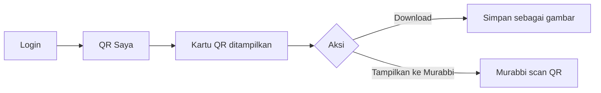

#### 2. Al-Quran Digital

- **Daftar Surat**: List 114 surat dengan nama Arab, nama latin, jumlah ayat, asbab nuzul
- **Baca Surat**: Tampilan ayat per ayat dengan teks Arab, transliterasi, terjemahan Indonesia
- **Tafsir Surat**: Tafsir per ayat dari sumber terpercaya

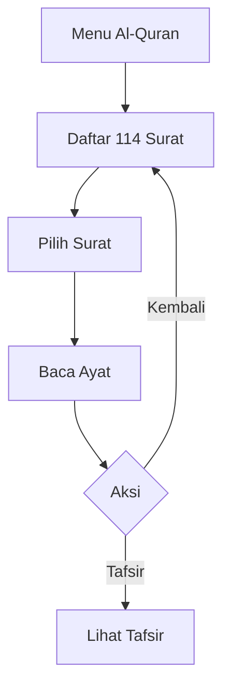

#### 3. Amalan Harian (Amalan Yaumi)

Fitur pencatatan amalan harian dengan 3 kategori:

**a. Input Amalan Harian**
- 5 Shalat Wajib (Subuh, Dzuhur, Ashar, Maghrib, Isya) → tepat waktu / terlambat / qadha
- Shalat Dhuha ✓/✗
- Jumlah rakaat sunnah (0-20)
- Tahajjud → tepat waktu / terlambat / qadha / tidak
- Bacaan Qur'an (juz, halaman, ayat)
- Berhalangan (jika berhalangan, otomatis skor = 0)

**b. Kalender Amalan**
- Tampilan kalender bulanan
- Hijau = ada catatan amalan
- Abu-abu = berhalangan
- Kosong = belum ada catatan

**c. Progress Amalan**
- Rata-rata skor harian
- Konsistensi shalat wajib (persentase tepat waktu)
- Konsistensi tahajjud
- Konsistensi bacaan Qur'an
- Total hari terisi

**Skor Maksimal: 35 poin per hari**
- 5 Shalat Wajib: 4×5 = 20 poin
- Dhuha: 3 poin
- Sunnah: 2 poin
- Tahajjud: 5 poin
- Bacaan Qur'an: 5 poin

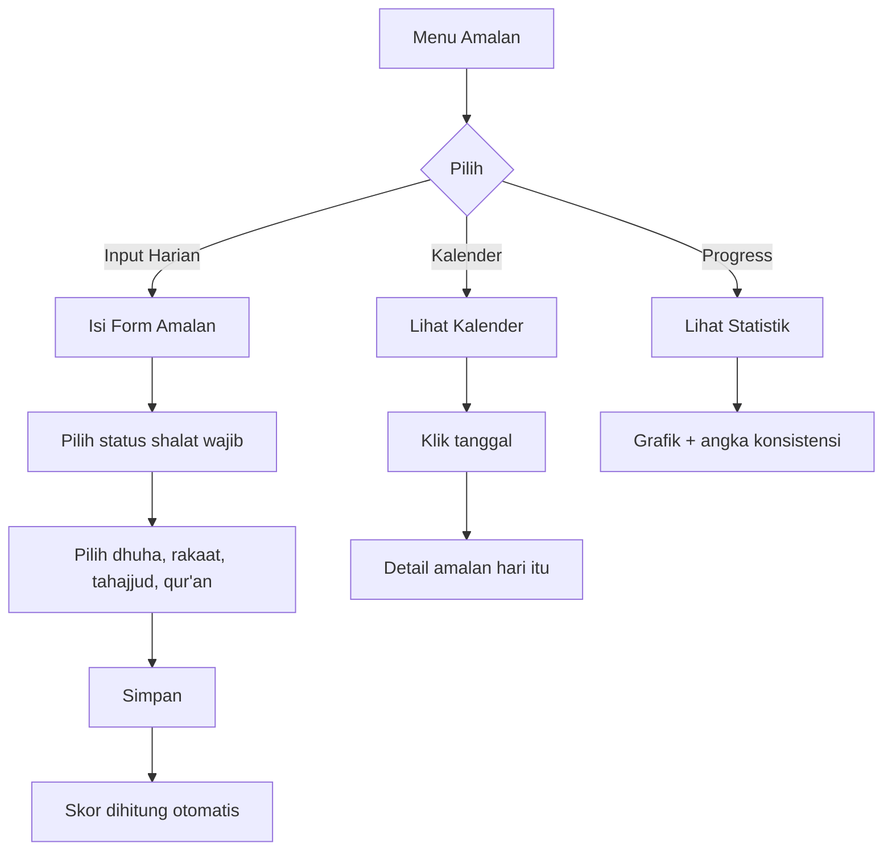

#### 4. Catatan Pribadi

Fitur catatan pribadi untuk mencatat hal-hal penting:
- **Daftar Catatan**: List semua catatan dengan filter
- **Tambah Catatan**: Judul + isi catatan
- **Edit Catatan**: Ubah catatan yang sudah ada
- **Detail Catatan**: Lihat detail lengkap

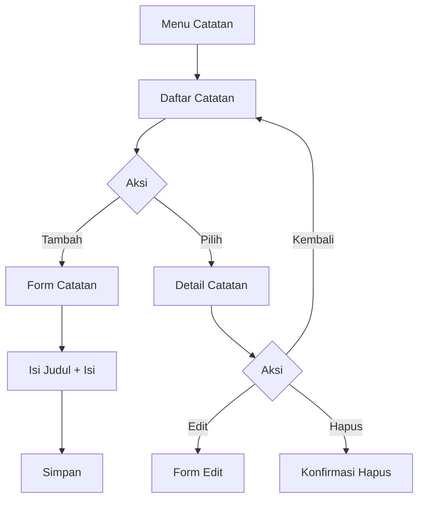

#### 5. Riwayat Kehadiran

- Lihat semua sesi yang sudah dihadiri
- Filter berdasarkan status (hadir / izin / alpa)
- Detail per sesi (tanggal, judul, status)

#### 6. Riwayat Penilaian ASA

- Lihat nilai penilaian ASA dari Murabbi
- Breakdown per komponen: Kehadiran, Sikap, Aktif, Roadmap, Posttest, Amalan
- Total nilai + Grade (A/B/C/D)

#### 7. Profil

- Lihat profil lengkap
- Ubah password
- Ubah email

---

### Admin / Murabbi

#### 1. Beranda (Status Sesi)

- Status sesi aktif saat ini
- Tombol **Buka Sesi** untuk memulai sesi baru
- Tombol **Akhiri Sesi** untuk mengakhiri sesi
- Jumlah anggota yang sudah hadir
- Realtime update (Supabase Realtime)

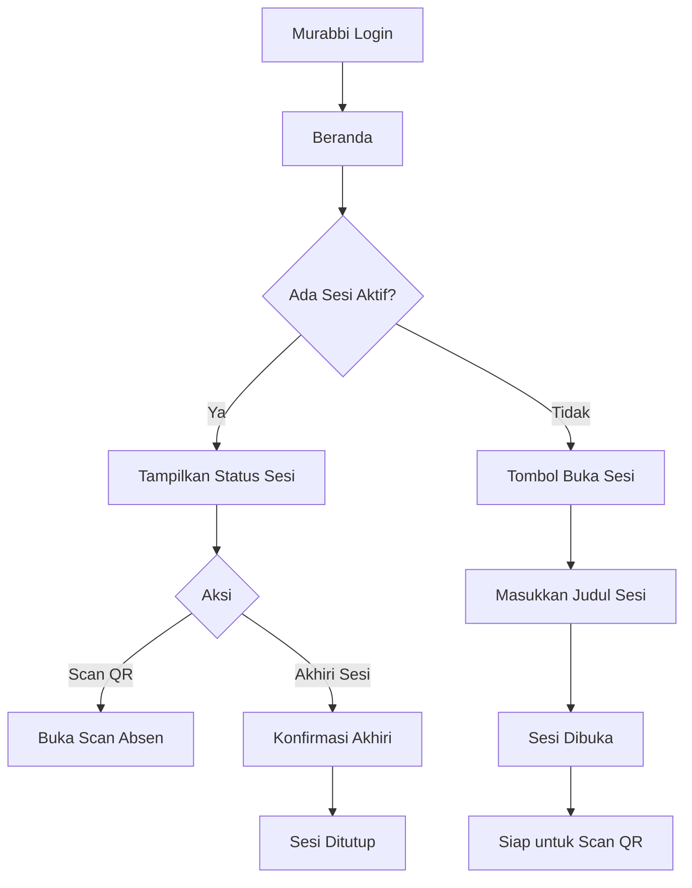

#### 2. Scan Absen (QR Scanner)

- Buka kamera HP untuk scan QR
- Real-time detection (otomatis terdeteksi)
- Tampilkan nama anggota yang berhasil di-scan
- Status: hadir / izin / alpa
- Debounce scan (mencegah scan ganda)
- Hanya bisa scan jika sesi sedang aktif

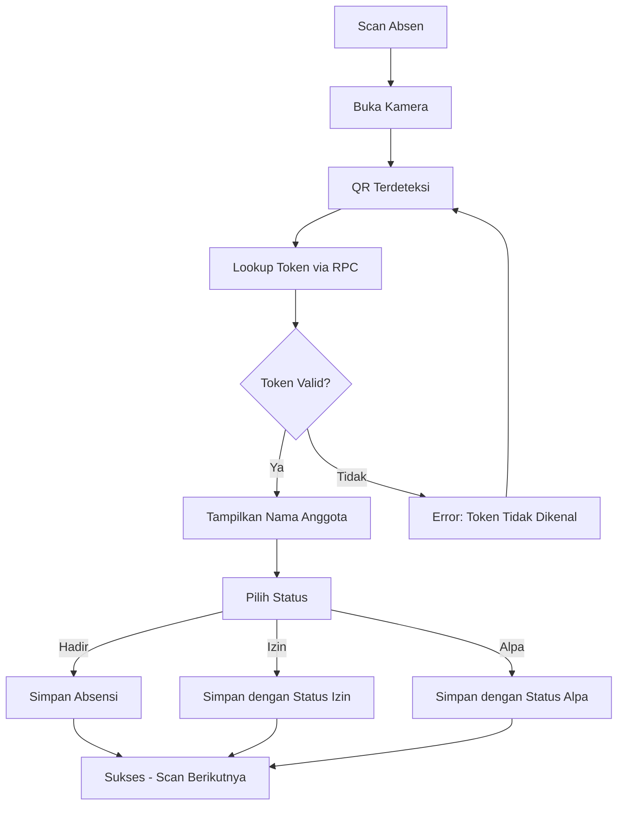

#### 3. Tambah Anggota

- Form manual untuk menambah anggota ke kelompok
- Input: Nama, NIM, Email, Password
- Otomatis assign ke kelompok Murabbi

#### 4. Anggota Saya

- List semua anggota di kelompok binaan
- Informasi: Nama, NIM, Status akun
- Filter & pencarian

#### 5. Riwayat Sesi

- Daftar semua sesi yang sudah dilaksanakan
- Detail per sesi: tanggal, judul, jumlah hadir
- Lihat siapa saja yang hadir

#### 6. Monitoring Amalan

- Overview amalan seluruh anggota kelompok
- Rata-rata skor harian per anggota
- Klik untuk lihat detail per anggota
- Filter tanggal

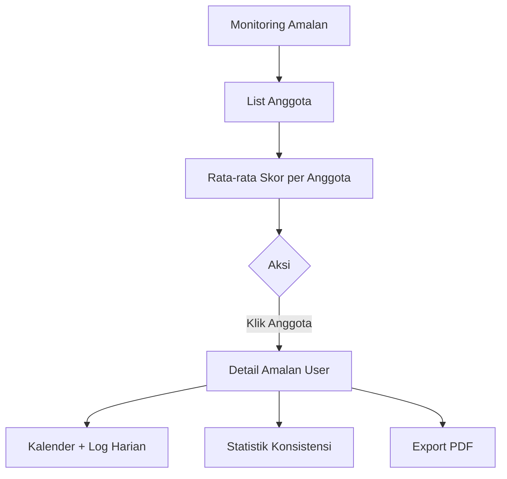

#### 7. Penilaian ASA

- **Daftar Penilaian**: List anggota + nilai (atau "Belum dinilai")
- **Form Penilaian**: Input 4 komponen manual + hitung otomatis 2 komponen
- **Komponen Penilaian**:
  - Kehadiran (10%) — otomatis dari sesi hadir / total sesi
  - Sikap & Kedisiplinan (20%) — input manual (0-100)
  - Keaktifan (20%) — input manual (0-100)
  - Refleksi & Roadmap (20%) — input manual (0-100)
  - Posttest (10%) — input manual (0-100)
  - Amalan Yaumi (20%) — otomatis dari rata-rata skor amalan

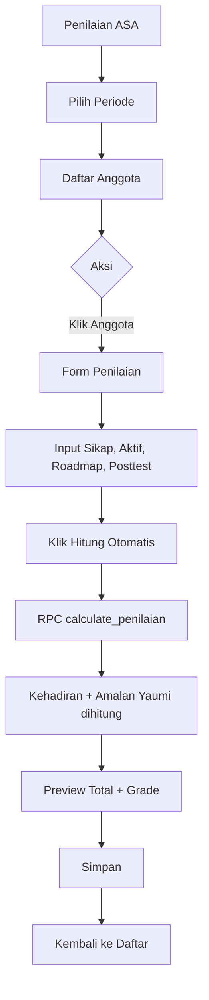

---

### Super Admin

#### 1. Dashboard Monitoring

- Total anggota aktif
- Total kelompok
- Total sesi hari ini
- Sesi aktif saat ini
- Tren kehadiran 7 hari terakhir (grafik)
- Jumlah akun pending

#### 2. Kelola Murabbi

- **Daftar**: List semua Murabbi dengan info kelompok
- **Tambah**: Form tambah Murabbi baru (nama, email, password)
- **Edit**: Ubah data Murabbi
- **Hapus**: Hapus Murabbi

#### 3. Kelola Kelompok

- **Daftar**: List semua kelompok
- **Tambah**: Buat kelompok baru + assign Murabbi
- **Edit**: Ubah nama kelompok / Murabbi
- **Hapus**: Hapus kelompok

#### 4. Kelola Akun

- **Daftar**: List semua akun (user, admin, super_admin)
- **Filter**: Berdasarkan role, status, kelompok
- **Edit**: Ubah data akun
- **Reset Password**: Reset password akun

#### 5. Approval Akun

- **Daftar Pending**: List akun menunggu approval (dengan badge counter)
- **Approve**: Setujui akun → status berubah ke `aktif`
- **Reject**: Tolak akun → status berubah ke `nonaktif`
- **Bulk Action**: Approve/reject multiple sekaligus

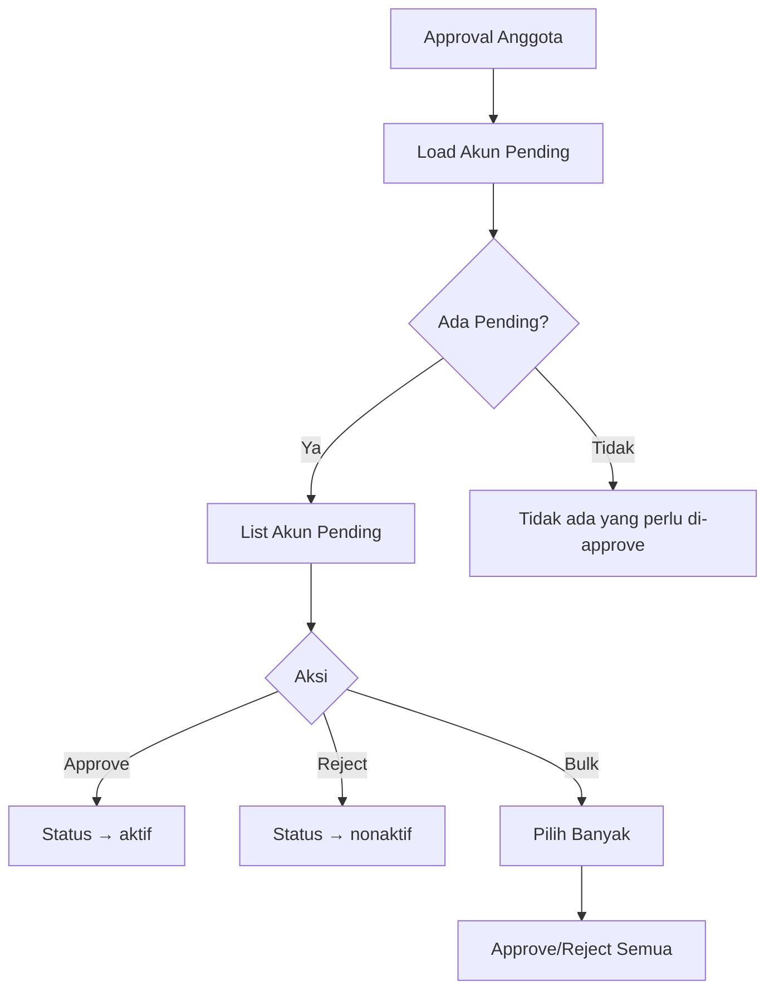

#### 6. Laporan

- **Filter**: Kelompok, Status (semua/aktif/selesai), Rentang tanggal
- **Tabel**: Data lengkap anggota + kehadiran + amalan
- **Export Excel**: Download .xlsx dengan sheet per filter
- **Export PDF**: Download PDF dengan tabel + timestamp

#### 7. Pengaturan ASA

- **Konfigurasi Tanggal**: Atur tanggal pelaksanaan ASA (bisa multi-day)
- **Periode**: Buat/ubah periode ASA (contoh: ASA-2026)
- **Aktifkan Periode**: Pilih periode aktif untuk penilaian
- **Hapus Periode**: Hapus periode yang tidak diperlukan

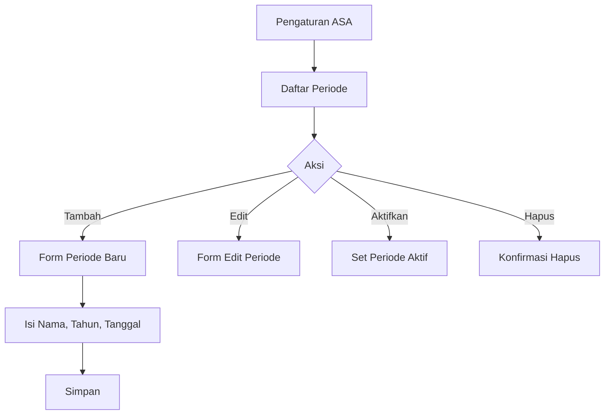

#### 8. Dashboard Penilaian

- **Ranking**: Peringkat anggota berdasarkan total nilai
- **Grade Distribution**: Distribusi grade A/B/C/D
- **Filter**: Berdasarkan periode, kelompok
- **Export PDF**: Download ranking sebagai PDF
- **Rata-rata**: Skor rata-rata seluruh anggota

#### 9. Pengaturan Sistem

- Konfigurasi umum aplikasi
- Pengaturan akun super admin

---

## Alur Penggunaan (Flow Diagrams)

### Alur Login & Registrasi

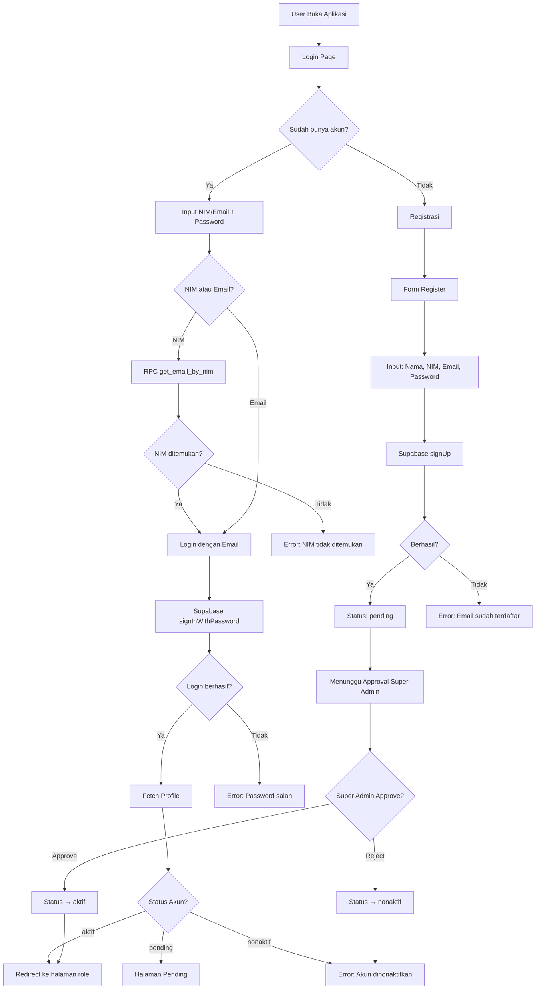

### Alur Absensi QR (Murabbi → Anggota)

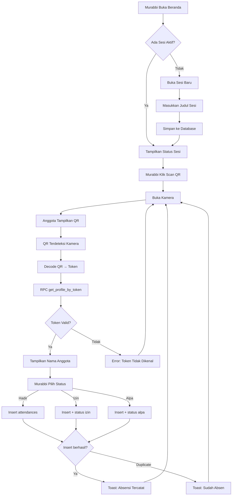

### Alur Amalan Harian

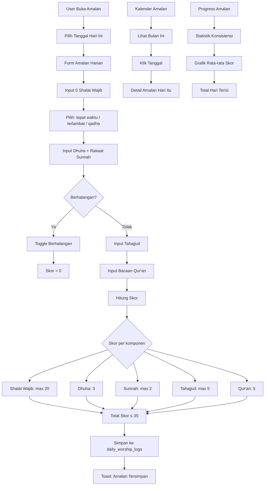

### Alur Penilaian ASA

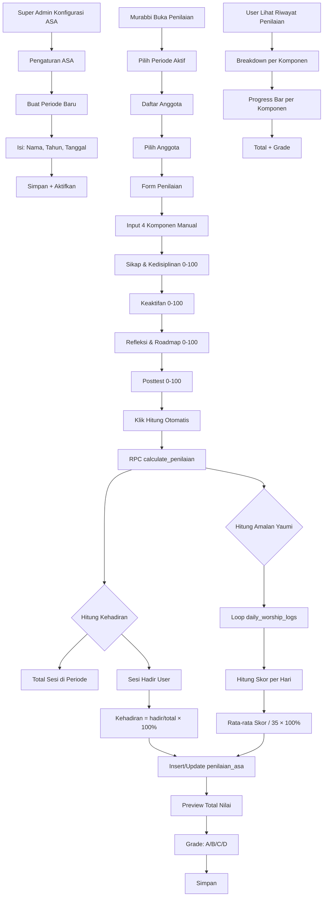

### Alur Approval Akun

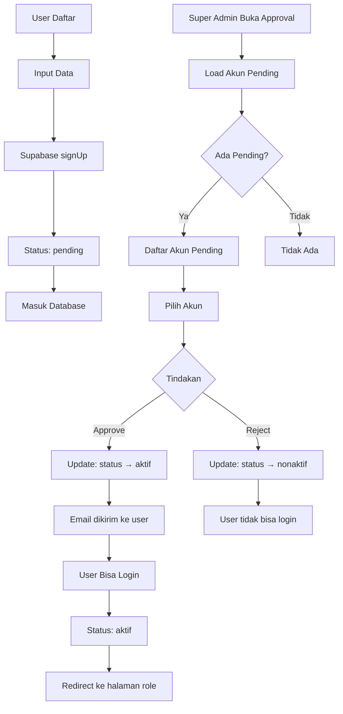

---

## Database Schema

### Tabel `profiles`

| Kolom | Tipe | Keterangan |
|-------|------|------------|
| id | uuid PK | Referensi auth.users (otomatis dari trigger) |
| email | text | Email user |
| nama | text | Nama lengkap |
| nim | text | Nomor Induk Mahasiswa (unique) |
| prodi | text | Program Studi |
| kelas | text | Kelas |
| angkatan | text | Tahun Angkatan |
| group_id | uuid FK | Referensi groups (kelompok) |
| role | text | `user`, `admin`, `super_admin` |
| qr_token | text UK | Token unik untuk QR Code |
| no_hp | text | Nomor HP |
| status_akun | text | `pending`, `aktif`, `nonaktif` |
| created_at | timestamptz | Waktu pembuatan |

### Tabel `groups`

| Kolom | Tipe | Keterangan |
|-------|------|------------|
| id | uuid PK | |
| nama_kelompok | text | Nama kelompok liqa (contoh: "Kelompok 36 Akhwat") |
| murabbi_id | uuid FK | Referensi profiles (admin/murabbi) |

### Tabel `sessions`

| Kolom | Tipe | Keterangan |
|-------|------|------------|
| id | uuid PK | |
| group_id | uuid FK | Referensi groups |
| judul | text | Judul sesi (opsional) |
| tanggal | date | Tanggal sesi |
| waktu_mulai | timestamptz | Waktu mulai sesi |
| waktu_selesai | timestamptz | Waktu selesai (null jika masih berlangsung) |
| created_by | uuid FK | Referensi profiles (murabbi) |

### Tabel `attendances`

| Kolom | Tipe | Keterangan |
|-------|------|------------|
| id | uuid PK | |
| session_id | uuid FK | Referensi sessions |
| user_id | uuid FK | Referensi profiles (anggota) |
| scanned_by | uuid FK | Referensi profiles (murabbi) |
| status | text | `hadir`, `izin`, `alpa` |
| waktu_absen | timestamptz | Waktu scan/absen |
| catatan | text | Catatan opsional |
| | | **Unique: (session_id, user_id)** |

### Tabel `daily_worship_logs`

| Kolom | Tipe | Keterangan |
|-------|------|------------|
| id | uuid PK | |
| user_id | uuid FK | Referensi profiles |
| tanggal | date | Tanggal catatan |
| shalat_subuh | text | `tepat_waktu` / `terlambat` / `qadha` |
| shalat_dzuhur | text | Sama |
| shalat_ashar | text | Sama |
| shalat_maghrib | text | Sama |
| shalat_isya | text | Sama |
| shalat_dhuha | boolean | true/false |
| jumlah_rakaat | integer | Jumlah rakaat sunnah (0-20) |
| tahajjud | text | `tepat_waktu` / `terlambat` / `qadha` / `tidak` |
| bacaan_quran | jsonb | `{juz: 1, halaman: 1, ayat: 1}` |
| berhalangan | boolean | true/false |
| alasan_berhalangan | text | Alasan berhalangan |
| catatan | text | Catatan tambahan |
| created_at | timestamptz | |

### Tabel `catatan`

| Kolom | Tipe | Keterangan |
|-------|------|------------|
| id | uuid PK | |
| user_id | uuid FK | Referensi profiles |
| judul | text | Judul catatan |
| isi | text | Isi catatan |
| created_at | timestamptz | |
| updated_at | timestamptz | |

### Tabel `asa_settings`

| Kolom | Tipe | Keterangan |
|-------|------|------------|
| id | uuid PK | |
| periode | text UK | Contoh: "ASA-2026" |
| nama_acara | text | Default: "Adzkia Spiritual Academy" |
| tahun | integer | Tahun pelaksanaan |
| tanggal | date[] | Array tanggal pelaksanaan |
| is_active | boolean | Periode aktif untuk penilaian |
| created_at | timestamptz | |
| updated_at | timestamptz | |

### Tabel `penilaian_asa`

| Kolom | Tipe | Keterangan |
|-------|------|------------|
| id | uuid PK | |
| user_id | uuid FK | Referensi profiles |
| periode | text | Referensi asa_settings.periode |
| kehadiran | integer | 0-100 (otomatis dari sesi) |
| sikap_kedisiplinan | integer | 0-100 (input manual) |
| keaktifan | integer | 0-100 (input manual) |
| roadmap | integer | 0-100 (input manual) |
| posttest | integer | 0-100 (input manual) |
| amalan_yaumi | integer | 0-100 (otomatis dari amalan) |
| total_nilai | numeric | **GENERATED ALWAYS** (otomatis dihitung DB) |
| catatan_mentor | text | Catatan dari Murabbi |
| created_at | timestamptz | |
| updated_at | timestamptz | |
| | | **Unique: (user_id, periode)** |

**Rumus `total_nilai` (PostgreSQL Generated Column):**
```
(kehadiran × 0.10) + (posttest × 0.10) +
(sikap_kedisiplinan × 0.20) + (amalan_yaumi × 0.20) +
(roadmap × 0.20) + (keaktifan × 0.20)
```

**Grade Mapping:**

| Grade | Rentang | Keterangan |
|-------|---------|------------|
| A | 90 - 100 | Sangat Memuaskan |
| B | 80 - 89 | Memuaskan |
| C | 70 - 79 | Cukup |
| D | < 70 | Perlu Perbaikan |

### Trigger

- `handle_new_user()` — Otomatis insert ke `profiles` saat user baru daftar (via `signUp`). Mengisi:
  - `id` dari `auth.users.id`
  - `nama` dari `raw_user_meta_data->>'nama'`
  - `qr_token` = random hex 32 char
  - `status_akun` = `pending`

---

## Row Level Security (RLS)

Semua tabel memiliki RLS aktif. Berikut ringkasan kebijakan:

### `profiles`
- **SELECT**: User lihat profil sendiri + semua admin/super_admin
- **UPDATE**: User update profil sendiri
- **INSERT**: Trigger only (handle_new_user)
- **DELETE**: Super admin only

### `groups`
- **SELECT**: Semua authenticated user
- **INSERT/UPDATE/DELETE**: Super admin only

### `sessions`
- **SELECT**: Semua authenticated user
- **INSERT**: Admin (murabbi) untuk kelompok sendiri
- **UPDATE**: Admin (murabbi) untuk sesi sendiri
- **DELETE**: Super admin only

### `attendances`
- **SELECT**: User lihat diri sendiri + admin lihat kelompok + super admin
- **INSERT**: Admin scan untuk kelompok sendiri
- **UPDATE**: Admin update untuk kelompok sendiri
- **DELETE**: Super admin only

### `daily_worship_logs`
- **SELECT**: User lihat diri sendiri + admin lihat kelompok + super admin
- **INSERT/UPDATE**: User untuk diri sendiri + super admin
- **DELETE**: Super admin only

### `catatan`
- **SELECT/INSERT/UPDATE/DELETE**: User untuk diri sendiri

### `asa_settings`
- **SELECT**: Semua authenticated user
- **ALL**: Super admin only

### `penilaian_asa`
- **SELECT**: User lihat diri sendiri + admin lihat kelompok + super admin
- **ALL**: Super admin only

---

## Fitur Export & Pelaporan

### Excel (.xlsx)
- Sheet per filter (kelompok/status)
- Header: Nama, NIM, Kelompok, Kehadiran, Amalan, Total, Grade
- Auto-width columns

### PDF
- Header: Judul laporan, periode, timestamp
- Tabel rapi dengan auto-pagination
- Footer: halaman X dari Y
- Tersedia di:
  - Laporan Super Admin (semua data)
  - Daftar Penilaian (per kelompok)
  - Detail Amalan User (per user)

---

## Deployment

### Frontend (Vercel)

```bash
# Install Vercel CLI
npm i -g vercel

# Deploy
vercel --prod
```

Set environment variables di dashboard Vercel:
- `VITE_SUPABASE_URL`
- `VITE_SUPABASE_ANON_KEY`

### Backend (Supabase)

Sudah otomatis — tinggal pakai project yang sudah di-setup. Pastikan:
- RLS aktif di semua tabel
- Trigger `handle_new_user()` berjalan
- Auth settings → **Confirm email** = off (kebutuhan internal)

### Service Worker

Aplikasi menggunakan Service Worker untuk:
- **Cache busting**: Nama cache di-bump setiap deploy baru
- **Network-first** untuk HTML dan JS/CSS (mencegah konten stale)
- **Cache-first** untuk gambar dan font
- Supabase API tidak di-cache

---

## Testing

```bash
npm run build
```

Pastikan build tanpa error. Cek juga:

### Manual Testing Checklist

- [ ] Route guard behavior (coba akses halaman tanpa login)
- [ ] Login dengan NIM
- [ ] Login dengan email
- [ ] Registrasi → pending → approval → aktif
- [ ] Buka sesi → scan QR → absen tercatat
- [ ] Input amalan harian → skor terhitung
- [ ] Lihat kalender amalan
- [ ] Lihat progress amalan
- [ ] Tambah/edit hapus catatan
- [ ] Baca Al-Quran (daftar surat, baca ayat, tafsir)
- [ ] Super admin kelola murabbi
- [ ] Super admin kelola kelompok
- [ ] Super admin approval akun
- [ ] Super admin konfigurasi ASA
- [ ] Murabbi input penilaian
- [ ] User lihat riwayat penilaian
- [ ] Export Excel
- [ ] Export PDF
- [ ] Responsive mobile & desktop

---

## License

Hak cipta © 2026 — Dibangun untuk internal liqa/halaqah.

---

Dibangun dengan Vue 3 + Supabase.
