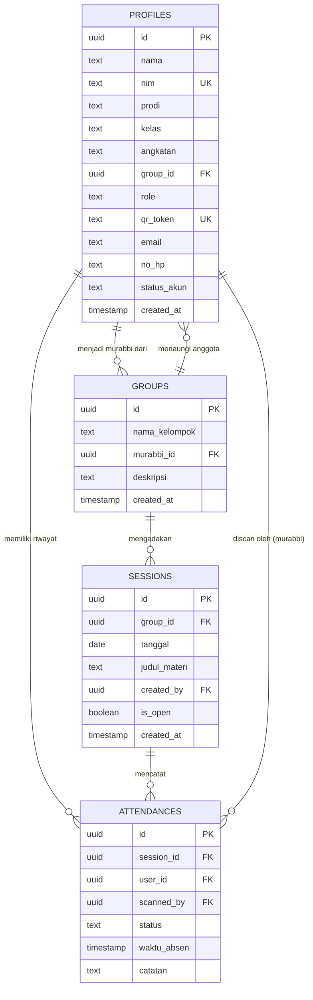
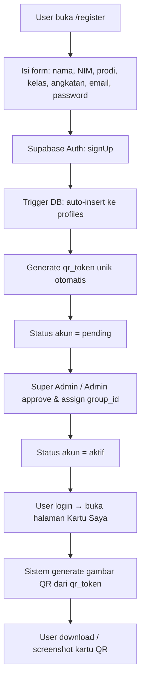
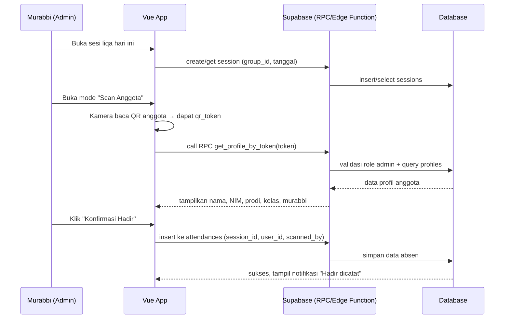
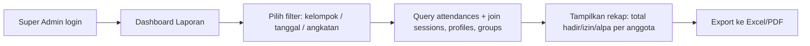
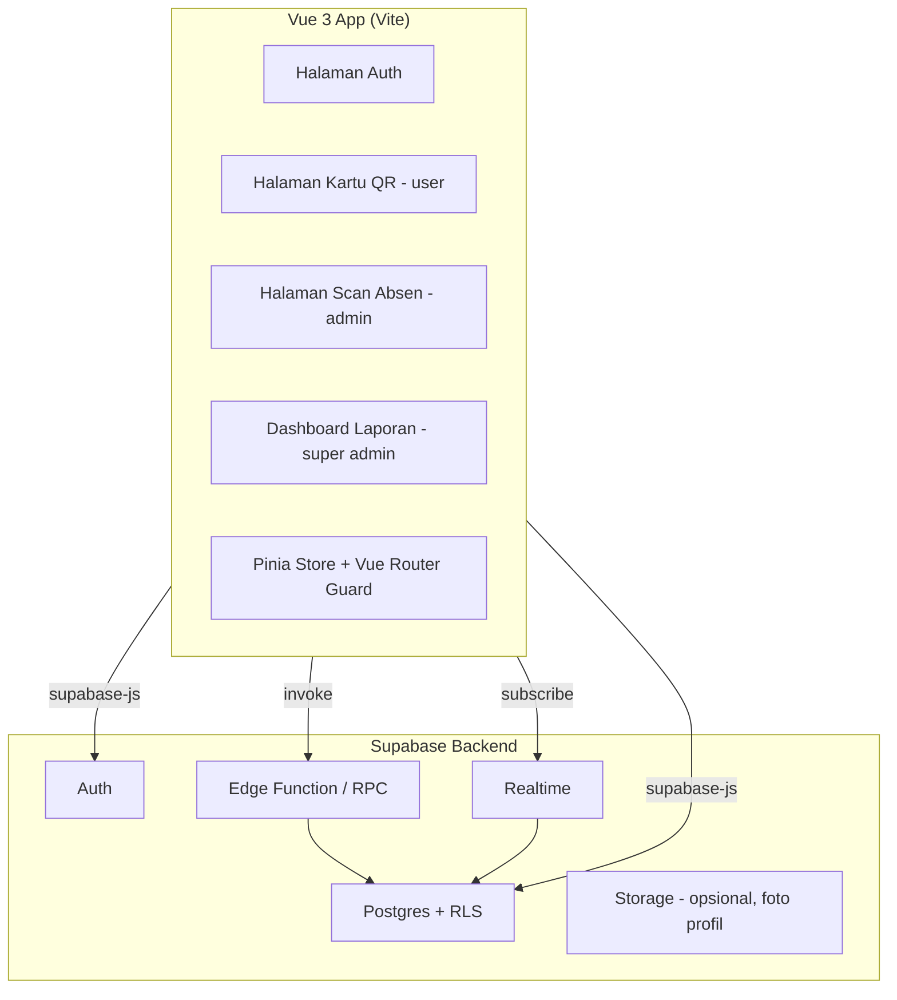
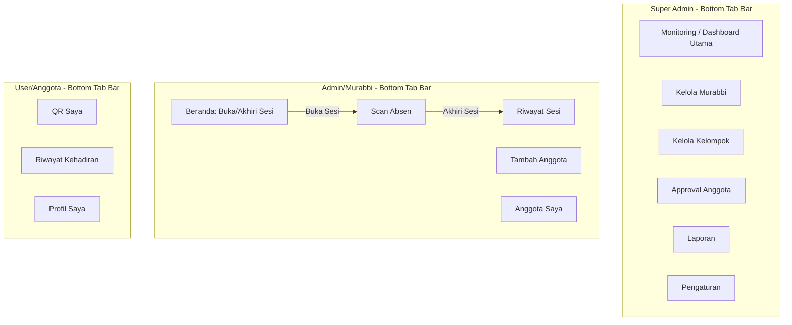

# Plan Konkrit — Aplikasi Absensi Liqa Berbasis QR Code
**Stack:** Vue 3 + Supabase (Postgres, Auth, RLS, Realtime, Edge Functions)

---

## 1. Ringkasan Sistem

Setiap **Anggota Liqa** mendapat **QR Kode personal (kartu anggota)** saat mendaftar. QR ini berisi token unik yang merujuk ke profil mereka (nama, NIM, prodi, kelas, angkatan, murabbi). Saat sesi liqa berlangsung, **Murabbi (Admin)** membuka mode *scan*, mengarahkan kamera ke QR anggota, sistem menampilkan data anggota tersebut, lalu Murabbi mengonfirmasi kehadiran. **Super Admin** memantau semua kelompok dan merampungkan laporan akhir.

### Prinsip Desain UI
- **Mobile First** — seluruh layout, komponen, dan interaksi dirancang **utama untuk layar HP** (scan QR & absen dilakukan langsung dari HP Murabbi), lalu **di-scale up secara responsif ke tablet & desktop** (breakpoint `md:`/`lg:` di Tailwind) — bukan versi terpisah, tapi satu codebase yang adaptif ke semua ukuran layar.
- **Laman berbeda per role** — Super Admin, Admin, dan User masing-masing punya set halaman/navigasi sendiri sesuai kebutuhannya (bukan satu dashboard generik untuk semua role). Lihat detail di **Section 7.1**.

### Role & Hak Akses

| Role | Hak Akses |
|---|---|
| **Super Admin** | Kelola semua Murabbi & Kelompok, lihat & export laporan gabungan, approve akun |
| **Admin (Murabbi)** | Buka sesi liqa, scan QR anggota untuk absen, kelola anggota kelompoknya, lihat rekap kelompok |
| **User (Anggota)** | Registrasi, lihat & download kartu QR sendiri, lihat riwayat kehadiran sendiri |

---

## 2. Entity Relationship Diagram (ERD)



---

## 3. SQL Schema (Supabase / Postgres)

```sql
-- Extension untuk UUID
create extension if not exists "pgcrypto";

-- ========== GROUPS ==========
create table groups (
    id uuid primary key default gen_random_uuid(),
    nama_kelompok text not null,
    murabbi_id uuid references auth.users(id),
    deskripsi text,
    created_at timestamptz default now()
);

-- ========== PROFILES ==========
create table profiles (
    id uuid primary key references auth.users(id) on delete cascade,
    nama text not null,
    nim text unique,
    prodi text,
    kelas text,
    angkatan text,
    group_id uuid references groups(id),
    role text not null default 'user' check (role in ('user','admin','super_admin')),
    qr_token text unique not null default encode(gen_random_bytes(16), 'hex'),
    email text,
    no_hp text,
    status_akun text default 'pending' check (status_akun in ('pending','aktif','nonaktif')),
    created_at timestamptz default now()
);

-- ========== SESSIONS ==========
create table sessions (
    id uuid primary key default gen_random_uuid(),
    group_id uuid references groups(id) not null,
    tanggal date not null default current_date,
    judul_materi text,
    created_by uuid references profiles(id),
    is_open boolean default true,
    dibuka_at timestamptz default now(),
    ditutup_at timestamptz,
    created_at timestamptz default now()
);

-- Cegah admin membuka lebih dari 1 sesi aktif dalam grup yang sama secara bersamaan
create unique index one_open_session_per_group
    on sessions (group_id)
    where (is_open = true);

-- ========== ATTENDANCES ==========
create table attendances (
    id uuid primary key default gen_random_uuid(),
    session_id uuid references sessions(id) not null,
    user_id uuid references profiles(id) not null,
    scanned_by uuid references profiles(id),
    status text default 'hadir' check (status in ('hadir','izin','alpa')),
    waktu_absen timestamptz default now(),
    catatan text,
    unique (session_id, user_id) -- cegah absen dobel di sesi sama
);

-- ========== TRIGGER: auto-insert profile saat user signup ==========
create or replace function handle_new_user()
returns trigger as $$
begin
    insert into public.profiles (id, nama, email)
    values (new.id, coalesce(new.raw_user_meta_data->>'nama', ''), new.email);
    return new;
end;
$$ language plpgsql security definer;

create trigger on_auth_user_created
    after insert on auth.users
    for each row execute procedure handle_new_user();
```

---

## 4. Row Level Security (RLS)

```sql
alter table profiles enable row level security;
alter table groups enable row level security;
alter table sessions enable row level security;
alter table attendances enable row level security;

-- PROFILES: user lihat & update data sendiri; admin/super_admin lihat semua
create policy "user lihat profil sendiri"
    on profiles for select
    using (auth.uid() = id or exists (
        select 1 from profiles p where p.id = auth.uid() and p.role in ('admin','super_admin')
    ));

create policy "user update profil sendiri"
    on profiles for update
    using (auth.uid() = id);

-- Admin boleh assign anggota yang belum punya grup (group_id null) ke grup miliknya sendiri
create policy "admin assign anggota tanpa grup"
    on profiles for update
    using (
        exists (select 1 from profiles p where p.id = auth.uid() and p.role in ('admin','super_admin'))
        and profiles.group_id is null
    );

-- GROUPS: semua yang login boleh lihat; hanya super_admin boleh insert/update
create policy "lihat groups" on groups for select using (auth.role() = 'authenticated');
create policy "kelola groups" on groups for all using (
    exists (select 1 from profiles p where p.id = auth.uid() and p.role = 'super_admin')
);

-- SESSIONS: admin hanya kelola sesi milik groupnya sendiri
create policy "admin kelola sesi kelompoknya"
    on sessions for all
    using (
        exists (
            select 1 from profiles p
            where p.id = auth.uid()
            and p.role in ('admin','super_admin')
            and (p.group_id = sessions.group_id or p.role = 'super_admin')
        )
    );

-- ATTENDANCES: hanya admin/super_admin boleh insert (via scan), user hanya boleh lihat riwayat sendiri
create policy "user lihat riwayat sendiri"
    on attendances for select
    using (auth.uid() = user_id or exists (
        select 1 from profiles p where p.id = auth.uid() and p.role in ('admin','super_admin')
    ));

create policy "admin catat kehadiran"
    on attendances for insert
    with check (
        exists (select 1 from profiles p where p.id = auth.uid() and p.role in ('admin','super_admin'))
    );
```

> ⚠️ **Penting:** Lookup profil berdasarkan `qr_token` **jangan** langsung pakai `SELECT` dari client dengan anon key (rawan brute-force semua data anggota). Gunakan **Supabase Edge Function / RPC** khusus yang hanya bisa dipanggil oleh role `admin`/`super_admin`, dan hanya me-return 1 baris sesuai token yang di-scan.

```sql
-- RPC aman untuk lookup by qr_token
create or replace function get_profile_by_token(token text)
returns table (id uuid, nama text, nim text, prodi text, kelas text, angkatan text, nama_kelompok text)
language plpgsql security definer as $$
begin
    if not exists (select 1 from profiles p where p.id = auth.uid() and p.role in ('admin','super_admin')) then
        raise exception 'unauthorized';
    end if;

    return query
    select pr.id, pr.nama, pr.nim, pr.prodi, pr.kelas, pr.angkatan, g.nama_kelompok
    from profiles pr
    left join groups g on g.id = pr.group_id
    where pr.qr_token = token;
end;
$$;
```

---

## 5. Alur Sistem (Flowchart)

### 5.1 Alur Registrasi & Pembuatan QR



### 5.2 Alur Absensi (Scan oleh Murabbi)



### 5.3 Alur Laporan (Super Admin)



---

## 6. Arsitektur Sistem



---

## 7. Struktur Halaman & Routing (Mobile First, Beda per Role)

### 7.1 Detail Fungsional Tiap Role

**🟣 Super Admin — Dashboard Multi-Tab**
- Laman utama = **Dashboard Monitoring**: ringkasan progress liqa lintas kelompok — grafik/kartu jumlah sesi berjalan hari ini, tingkat kehadiran per kelompok, aktivitas Admin (siapa yang sudah/belum buka sesi minggu ini), tren kehadiran anggota dari waktu ke waktu.
- Tab-tab dashboard:
  - **Monitoring** (laman utama di atas)
  - **Kelola Murabbi** — CRUD akun admin, assign admin ke kelompok
  - **Kelola Kelompok** — CRUD kelompok liqa
  - **Approval Anggota** — approve akun baru yang masih `pending`
  - **Laporan** — rekap & export (filter kelompok/tanggal/angkatan)
  - **Pengaturan** — profil super admin, kelola role

**🔵 Admin (Murabbi)**
- **Laman Utama (Beranda)** — status sesi hari ini (kosong / sedang berjalan), ringkasan kelompok (jumlah anggota, kehadiran terakhir)
- **Buka/Akhiri Sesi** — tombol besar mobile-friendly:
  - `Buka Sesi` → insert row baru ke `sessions` (is_open = true, dibuka_at = now())
  - Selama sesi terbuka, tombol berubah jadi `Scan Absen` (masuk ke kamera scan) dan `Akhiri Sesi`
  - `Akhiri Sesi` → update `is_open = false`, `ditutup_at = now()`, tampilkan ringkasan hasil absen sesi tsb (hadir/izin/alpa)
- **Scan Absen** — hanya aktif ketika ada sesi terbuka; buka kamera → scan QR anggota → tampil profil → konfirmasi hadir
- **Tambah Anggota** — daftar anggota yang **belum memiliki grup** (`group_id IS NULL`, status `aktif`) → admin pilih & assign ke kelompoknya (pakai policy "admin assign anggota tanpa grup")
- **Anggota Saya** — daftar anggota di kelompoknya + riwayat kehadiran masing-masing
- **Riwayat Sesi** — daftar sesi yang sudah pernah dibuka & ditutup beserta rekap kehadiran

**🟢 User (Anggota)**
- **Laman QR (Kartu Saya)** — QR code besar di tengah layar (mudah discan Murabbi), + nama, NIM, kelompok
- **Catatan Kehadiran (Riwayat)** — daftar per sesi liqa yang diikuti: tanggal, judul materi, status (hadir/izin/alpa) — data ini **tersimpan permanen per akun** (query dari tabel `attendances` where `user_id = auth.uid()`, join `sessions`)
- **Profil Saya** — lihat data diri (edit terbatas: no HP dsb, field akademik dikunci/hanya bisa request perubahan ke admin)

### 7.2 Tabel Routing

| Route | Role | Fungsi | Catatan Mobile |
|---|---|---|---|
| `/login`, `/register` | Publik | Auth | Form single-column, full width |
| `/qr-saya` | User | Halaman utama user — tampilkan QR besar | Default landing setelah login sebagai user |
| `/riwayat` | User | Catatan kehadiran per sesi, tersimpan permanen | List/card view, infinite scroll |
| `/profil` | User | Lihat/edit data diri terbatas | — |
| `/beranda` | Admin | Landing admin — status sesi & ringkasan kelompok | Tombol Buka/Akhiri Sesi paling menonjol |
| `/scan-absen` | Admin | Kamera scan QR anggota (aktif bila sesi terbuka) | Full-screen camera view |
| `/tambah-anggota` | Admin | List anggota `group_id IS NULL` → assign ke grup | Search + tombol assign per item |
| `/anggota-saya` | Admin | Daftar anggota kelompok + riwayat masing-masing | — |
| `/riwayat-sesi` | Admin | Log sesi yang sudah ditutup + rekap | — |
| `/dashboard` | Super Admin | **Laman utama** — monitoring progress semua kelompok | Tab bar bawah (bottom nav) untuk mobile |
| `/dashboard/murabbi` | Super Admin | Tab: kelola akun admin/murabbi | — |
| `/dashboard/kelompok` | Super Admin | Tab: kelola kelompok liqa | — |
| `/dashboard/approval` | Super Admin | Tab: approve akun pending | — |
| `/dashboard/laporan` | Super Admin | Tab: laporan & export | — |
| `/dashboard/pengaturan` | Super Admin | Tab: pengaturan akun & role | — |

**Route guard**: `router.beforeEach` cek session Supabase Auth → ambil `role` dari `profiles` → redirect ke landing page sesuai role (`user` → `/qr-saya`, `admin` → `/beranda`, `super_admin` → `/dashboard`). Navigasi mobile pakai **bottom tab bar** per role (bukan sidebar desktop), agar konsisten dengan prinsip Mobile First.

### 7.3 Desain Kartu QR — Nuansa Islamic

Kartu QR di laman "QR Saya" (User) menjadi elemen visual utama aplikasi, dirancang dengan nuansa Islamic yang elegan dan tetap fungsional untuk discan:

- **Palet warna**: hijau tua/zamrud (`#0F5132` – `#14532D`) atau navy sebagai warna dasar, dikombinasikan aksen emas/gold (`#D4AF37`) untuk border & detail, latar krem/off-white (`#FDF6E3`) agar kontras QR tetap tinggi (WCAG AA) — QR code sendiri **tetap hitam-putih murni** di dalam frame, jangan diberi warna/gradasi supaya tetap mudah discan kamera.
- **Motif bingkai (frame)**: ornamen geometris Islamic (girih/tessellation) atau lengkung arabesque di sudut-sudut kartu sebagai border dekoratif — dipakai sebagai elemen dekoratif di luar area QR, bukan menimpa/overlay di atas modul QR.
- **Tipografi**: nama & identitas pakai font serif/elegant (mis. Playfair Display atau font Arab-Latin hybrid) untuk kesan formal-religius, sedangkan data teknis (NIM, kelas) tetap pakai sans-serif agar tetap terbaca jelas di layar kecil.
- **Elemen tambahan opsional**: kaligrafi kecil/ornamen bulan-bintang tipis di header kartu, badge nama kelompok liqa di bagian bawah kartu.
- **Kontras & aksesibilitas wajib dijaga**: apa pun ornamennya, area quiet-zone di sekeliling QR (margin putih standar QR) tidak boleh ditimpa ornamen apa pun agar tetap terbaca kamera.

### 7.4 Instalasi Tool Bantu Desain — UI UX Pro Max

Sebelum membangun komponen UI (terutama Kartu QR bernuansa Islamic ini), install skill design-intelligence berikut agar hasil styling lebih terarah & konsisten:

```bash
npm install -g ui-ux-pro-max-cli
cd /path/to/project
uipro init --ai opencode
```

Setelah terpasang, skill ini otomatis aktif saat diminta kerjaan UI/UX (styling, palet warna, tipografi, dsb) dan bisa dipakai untuk generate design system yang konsisten di seluruh aplikasi, termasuk tema Islamic untuk Kartu QR di atas.

### 7.5 Diagram Navigasi per Role



---

## 8. Tech Stack Detail

- **Frontend:** Vue 3 (Composition API) + Vite + Pinia + Vue Router
- **UI:** Tailwind CSS
- **QR Generate:** `qrcode` (npm)
- **QR Scan:** `vue-qrcode-reader` atau `html5-qrcode`
- **Backend:** Supabase (Postgres, Auth, RLS, Edge Functions, Realtime)
- **Export laporan:** `xlsx` (SheetJS) atau `jspdf`
- **Hosting:** Vercel/Netlify (frontend), Supabase Cloud (backend)

---

## 9. Roadmap Pengerjaan

| Fase | Deliverable |
|---|---|
| **1. Setup** | Init Supabase project, jalankan SQL schema + RLS, init Vue project |
| **2. Auth** | Halaman login/register, trigger auto-profile, approval flow |
| **3. Kartu QR** | Generate & tampilkan QR di halaman "Kartu Saya" |
| **4. Scan Absen** | Halaman scan (admin), RPC `get_profile_by_token`, insert attendance |
| **5. Manajemen** | CRUD groups, sesi, anggota (admin & super admin) |
| **6. Laporan** | Dashboard rekap, filter, export Excel/PDF |
| **7. Polish** | Realtime live update saat scan, notifikasi, responsive mobile UI |
| **8. Deploy** | Deploy frontend + setup env production Supabase |

---

## 10. Checklist Keamanan

- [ ] `qr_token` random (bukan NIM/nama), disimpan sebagai `unique`
- [ ] Lookup token via RPC (`security definer`) — bukan query langsung dari client
- [ ] RLS aktif di semua tabel, tidak ada tabel yang terbuka penuh
- [ ] Admin hanya bisa akses data groupnya sendiri (kecuali super_admin)
- [ ] Unique constraint `(session_id, user_id)` di `attendances` — cegah absen dobel
- [ ] Status akun `pending` sebelum di-approve, cegah user asal daftar bisa absen
- [ ] (Opsional) tambah verifikasi tambahan saat scan — misal foto otomatis atau PIN — untuk cegah titip absen
